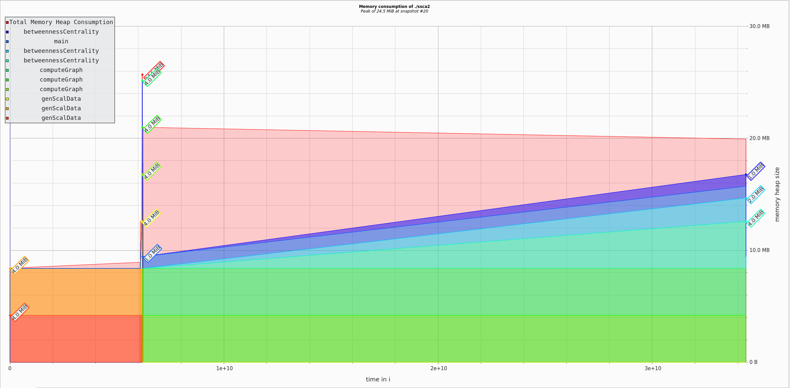

## Exercise 1

```
massif-visualizer [massif-data-file] => massif.out.%pid
```

As we can see both programs need to allocate more or less the same amount of memory eventho the workload is different

### a


### s


Runtime with massif
3.3s

Runtime without massif
0.3s

As for ssca2 



The program's memory usage starts at 8.5 MB of the heap. We firtsly generate "Scal Data" three times. It stabilizes for a while before experiencing a sudden peak to 25.69 MB for the betweennessCentrality() of function for all three generated sets. Then it followes a drop to 10 MB. Afterward, it fluctuates between around 8 to 25 MB Towards the end, it reaches another peak of 20.99 MB. In general the computeGraph() functions are stable as they need with time a little more memory. 


The perturbation in execution time caused by using Massif can be potentially massive.

Runtime with massif
1.25min

Runtime without massif
0.51s


## Exercise 2
Comparing the relative metrics between the two programs based on the perf output:

### L1 Data Cache Metrics:
#### Load Misses:
- **ssca2**
    - L1-dcache-load-misses: 2
    - L1-dcache-loads: 27886
    - L1-dcache-load-miss rate: 2 / 27886 = 0.00717%
- **npb_bt_a**
    - L1-dcache-load-misses: 31,000
    - L1-dcache-loads: 22,279,931,726
    - L1-dcache-load-miss rate: 31,000 / 22,279,931,726 = 0.000139%

#### Store Misses:
- **ssca2**
    - L1-dcache-store-misses: 5
    - L1-dcache-stores: 29,537
    - L1-dcache-store-miss rate: 5 / 29,537 = 0.0169%
- **npb_bt_a**
    - L1-dcache-store-misses: 39,000
    - L1-dcache-stores: 10,465,758,282
    - L1-dcache-store-miss rate: 39,000 / 10,465,758,282 = 0.000372%

### L1 Instruction Cache Metrics:
#### Load Misses:
- **ssca2**
    - L1-icache-load-misses: N/A
    - L1-icache-loads: N/A
- **npb_bt_a**
    - L1-icache-load-misses: 30,000
    - L1-icache-loads: 20,112,958,997
    - L1-icache-load-miss rate: 30,000 / 20,112,958,997 = 0.000149%

### LLC Cache Metrics:
#### Load Misses:
- **ssca2**
    - LLC-load-misses: 29,000
    - LLC-loads: 86,031,270
    - LLC-load-miss rate: 29,000 / 86,031,270 = 0.0337%
- **npb_bt_a**
    - LLC-load-misses: 276
    - LLC-loads: 1,668,589
    - LLC-load-miss rate: 276 / 1,668,589 = 0.0165%

#### Store Misses:
- **ssca2**
    - LLC-store-misses: N/A
    - LLC-stores: N/A
- **npb_bt_a**
    - LLC-store-misses: 6,000
    - LLC-stores: 30,595,190
    - LLC-store-miss rate: 6,000 / 30,595,190 = 0.0196%

### TLB Metrics:
#### Load Misses:
- **ssca2**
    - dTLB-load-misses: 30,000
    - dTLB-loads: 1,243,211
    - dTLB-load-miss rate: 30,000 / 1,243,211 = 2.41%
- **npb_bt_a**
    - dTLB-load-misses: N/A
    - dTLB-loads: N/A

#### Store Misses:
- **ssca2**
    - dTLB-store-misses: N/A
    - dTLB-stores: N/A
- **npb_bt_a**
    - dTLB-store-misses: N/A
    - dTLB-stores: N/A

### Branch Metrics:
#### Load Misses:
- **ssca2**
    - branch-load-misses: 41,000
    - branch-loads: 262,225,733
    - branch-load-miss rate: 41,000 / 262,225,733 = 0.0156%
- **npb_bt_a**
    - branch-load-misses: 31,000
    - branch-loads: 132,999,343
    - branch-load-miss rate: 31,000 / 132,999,343 = 0.0233%

#### Store Misses:
- **ssca2**
    - branch-store-misses: 10,000
    - branch-stores: 30,595,190
    - branch-store-miss rate: 10,000 / 30,595,190 = 0.0327%
- **npb_bt_a**
    - branch-store-misses: N/A
    - branch-stores: N/A

### Conclusion
- npb_bt_a generally exhibits lower cache miss rates across L1, LLC, and TLB caches compared to ssca2.
- ssca2 shows higher miss rates in most cache metrics, indicating potentially less cache-friendly behavior or more intensive cache usage compared to npb_bt_a.
- However, ssca2 has a higher branch-miss rate, indicating potentially less efficient branching behavior compared to npb_bt_a.

### Time influence
npb_bt_a:

time with perf: 1:16.39
time without perf: 1:13.95

ssca2:
time with perf: 0:31.75
time without perf: 0:32.53