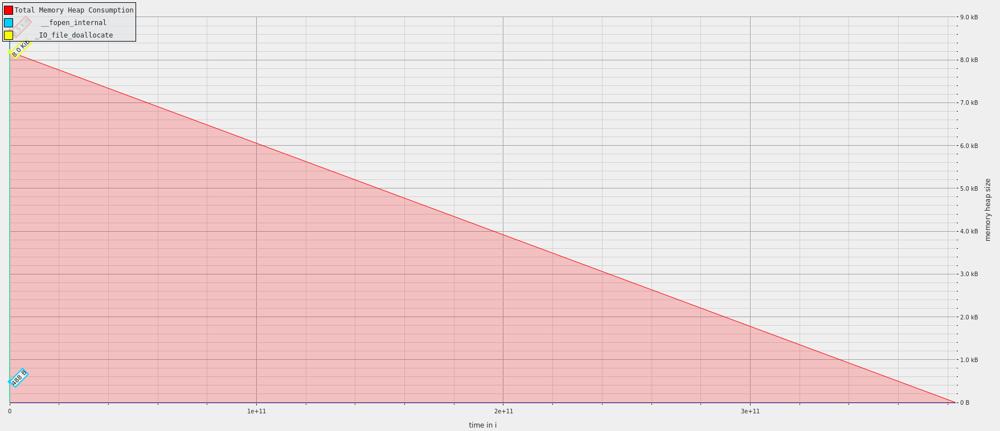

## Exercise 1

```
massif-visualizer [massif-data-file] => massif.out.%pid
```

As we can see both programs need to allocate more or less the same amount of memory eventho the workload is different

### a


### s


Runtime with massif
3.3s

Runtime without massif
0.3s

As for ssca2 


The program's memory usage starts at 8.5 MB of the heap. We firtsly generate "Scal Data" three times. It stabilizes for a while before experiencing a sudden peak to 25.69 MB for the betweennessCentrality() of function for all three generated sets. Then it followes a drop to 10 MB. Afterward, it fluctuates between around 8 to 25 MB Towards the end, it reaches another peak of 20.99 MB. In general the computeGraph() functions are stable as they need with time a little more memory. 


The perturbation in execution time caused by using Massif can be potentially massive.

Runtime with massif
1.25min

Runtime without massif
0.51s


## Exercise 2
I decided to test the npb_bt_a and npb_bt_s programs as comparing one of them with ssca2 would not make sense as it calculates something different and we do not have the same functions inside

L1-dcache-load-misses:u

a)
```	
# Samples: 31K of event 'L1-dcache-load-misses:u'
# Event count (approx.): 729337502
#
# Overhead  Command   Shared Object  Symbol            
# ........  ........  .............  ..................
#
    21.90%  npb_bt_a  npb_bt_a       [.] z_solve
    21.86%  npb_bt_a  npb_bt_a       [.] y_solve
    16.54%  npb_bt_a  npb_bt_a       [.] x_solve
    13.70%  npb_bt_a  npb_bt_a       [.] compute_rhs
    12.02%  npb_bt_a  npb_bt_a       [.] binvcrhs
     7.35%  npb_bt_a  npb_bt_a       [.] matvec_sub
     4.86%  npb_bt_a  npb_bt_a       [.] matmul_sub
     0.93%  npb_bt_a  npb_bt_a       [.] add
     0.78%  npb_bt_a  npb_bt_a       [.] lhsinit
     0.05%  npb_bt_a  npb_bt_a       [.] binvrhs
     0.01%  npb_bt_a  npb_bt_a       [.] exact_rhs
     0.00%  npb_bt_a  npb_bt_a       [.] exact_solution
     0.00%  npb_bt_a  npb_bt_a       [.] initialize
```	

s)
```
#
# Samples: 8  of event 'L1-dcache-load-misses:u'
# Event count (approx.): 177698
#
# Overhead  Command   Shared Object  Symbol         
# ........  ........  .............  ...............
#
    46.36%  npb_bt_s  npb_bt_s       [.] x_solve
    28.29%  npb_bt_s  npb_bt_s       [.] compute_rhs
    25.36%  npb_bt_s  npb_bt_s       [.] add

```

As we can see the s has less event counts because of the workload. The a has more event counts because of the workload. The functions that are most responsible for the cache misses are x_solve, compute_rhs, add.


L1-dcache-loads:u

a)
```
# Samples: 42K of event 'L1-dcache-loads:u'
# Event count (approx.): 22279931726
#
# Overhead  Command   Shared Object     Symbol                  
# ........  ........  ................  ........................
#
    35.86%  npb_bt_a  npb_bt_a          [.] binvcrhs
    26.02%  npb_bt_a  npb_bt_a          [.] matmul_sub
     8.52%  npb_bt_a  npb_bt_a          [.] x_solve
     8.46%  npb_bt_a  npb_bt_a          [.] z_solve
     8.42%  npb_bt_a  npb_bt_a          [.] y_solve
     6.72%  npb_bt_a  npb_bt_a          [.] compute_rhs
     5.35%  npb_bt_a  npb_bt_a          [.] matvec_sub
     0.23%  npb_bt_a  npb_bt_a          [.] binvrhs
     0.17%  npb_bt_a  npb_bt_a          [.] exact_solution
     0.15%  npb_bt_a  npb_bt_a          [.] add
     0.05%  npb_bt_a  npb_bt_a          [.] exact_rhs
     0.02%  npb_bt_a  npb_bt_a          [.] initialize
     0.01%  npb_bt_a  npb_bt_a          [.] lhsinit
     0.00%  npb_bt_a  ld-2.28.so        [.] do_lookup_x
     0.00%  npb_bt_a  ld-2.28.so        [.] __GI___tunables_init
     0.00%  npb_bt_a  ld-2.28.so        [.] _dl_start
     0.00%  npb_bt_a  [unknown]         [k] 0xffffffffb8e01150
     0.00%  npb_bt_a  ld-2.28.so        [.] _start
```

s)
```

# Samples: 63  of event 'L1-dcache-loads:u'
# Event count (approx.): 28650606
#
# Overhead  Command   Shared Object     Symbol                  
# ........  ........  ................  ........................
#
    44.94%  npb_bt_s  npb_bt_s          [.] binvcrhs
    20.08%  npb_bt_s  npb_bt_s          [.] matmul_sub
    10.63%  npb_bt_s  npb_bt_s          [.] x_solve
    10.00%  npb_bt_s  npb_bt_s          [.] z_solve
     9.27%  npb_bt_s  npb_bt_s          [.] compute_rhs
     1.91%  npb_bt_s  npb_bt_s          [.] y_solve
     1.51%  npb_bt_s  npb_bt_s          [.] exact_solution
     1.11%  npb_bt_s  npb_bt_s          [.] matvec_sub
     0.26%  npb_bt_s  ld-2.28.so        [.] _dl_relocate_object
     0.24%  npb_bt_s  npb_bt_s          [.] initialize
     0.05%  npb_bt_s  ld-2.28.so        [.] __GI___tunables_init
     0.00%  npb_bt_s  ld-2.28.so        [.] _dl_start
     0.00%  npb_bt_s  [unknown]         [k] 0xffffffffb8e01150
     0.00%  npb_bt_s  ld-2.28.so        [.] _start

```

We can see the difference in sample counts. If we leave out the workload, the function order with more cache misses are the same. The functions that are most responsible for the cache misses are binvcrhs, matmul_sub, x_solve, z_solve, compute_rhs.


### Conclusion
In overall the spread is very similar but often also difffernt so we can not make a general conclusion. The workload is the most important factor in this case.

### Time influence
npb_bt_a:

time with perf: 1:16.39
time without perf: 1:13.95

ssca2:
time with perf: 0:31.75
time without perf: 0:32.53